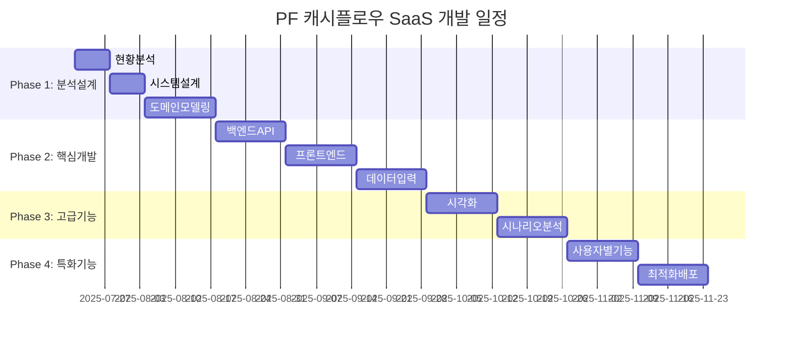

# PF 캐시플로우 SaaS 개발 마스터플랜

> [!info] 프로젝트 개요
> - **목표**: Excel 기반 PF 캐시플로우 모델의 완전한 디지털화
> - **범위**: 시공사, 시행사, 수탁사, 증권사용 통합 솔루션
> - **기간**: MVP 3개월, 확장 6개월
> - **담당**: 현대엔지니어링 주택영업1부

## 📋 전체 프로젝트 구조



---

## 🚀 Phase 1: 기반 분석 및 설계 (4주)

### Week 1: 현황 분석 및 요구사항 정의

#### 📊 1.1 Excel 모델 완전 분석
- [ ] **1.1.1** 기존 Excel 템플릿 업로드 및 구조 파악
  - 워크시트별 역할 분석 (입력/계산/출력)
  - 셀 참조 관계 매핑
  - 수식 복잡도 평가
- [ ] **1.1.2** 캐시플로우 로직 추출
  - 수익 인식 시점 및 조건
  - 건설비 지급 스케줄 로직
  - 금융비용 계산 방식
  - 분양수입 예측 모델
- [ ] **1.1.3** 데이터 플로우 다이어그램 작성
  - 입력 데이터 → 계산 프로세스 → 출력 결과
  - 의존성 관계 분석

#### 🏗️ 1.2 비즈니스 도메인 분석
- [ ] **1.2.1** PF 구조별 특성 분석
  - [[토지임대형 vs 토지매입형]]
  - [[선분양 vs 후분양 모델]]
  - [[조합사업 vs 정비사업]] 차이점
- [ ] **1.2.2** 이해관계자별 관심사항
  - **시공사**: 공사비 현금흐름, [[완공보증 리스크]]
  - **시행사**: 분양률, 수익률, [[자금조달 계획]]
  - **수탁사**: 신탁보수, [[리스크 모니터링]]
  - **증권사**: 대출 안전성, [[담보가치 평가]]
- [ ] **1.2.3** 리스크 요소 식별
  - [[분양률 변동 시나리오]]
  - [[건설비 상승 영향]]
  - [[금리 변동 민감도]]
  - [[인허가 지연 리스크]]

### Week 2: 시스템 아키텍처 설계

#### ⚙️ 2.1 기술 아키텍처 설계
- [ ] **2.1.1** 프론트엔드 구조
  - Next.js 13+ App Router 구조
  - 컴포넌트 계층구조 설계
  - 상태 관리 전략 (Zustand/Redux)
  - UI 라이브러리 선정 (Shadcn/ui)
- [ ] **2.1.2** 백엔드 구조  
  - FastAPI 프로젝트 구조
  - 도메인 주도 설계 적용
  - 데이터베이스 설계 (PostgreSQL)
  - 캐시 전략 (Redis)
- [ ] **2.1.3** 데이터 아키텍처
  - [[엔티티 관계 다이어그램]]
  - [[API 스키마 설계]]
  - 파일 저장 전략

#### 🎨 2.2 사용자 경험 설계
- [ ] **2.2.1** 사용자 여정 매핑
  - 프로젝트 생성 → 데이터 입력 → 시나리오 분석 → 보고서 생성
- [ ] **2.2.2** 화면 설계 (Wireframe)
  - [[대시보드 레이아웃]]
  - [[데이터 입력 폼]]
  - [[차트 및 그래프 배치]]
  - [[보고서 템플릿]]
- [ ] **2.2.3** 인터랙션 디자인
  - 실시간 계산 결과 반영
  - 드래그 앤 드롭 파일 업로드
  - 시나리오 비교 기능

### Week 3-4: 데이터 모델 및 비즈니스 로직 설계

#### 📐 3.1 도메인 모델링
- [ ] **3.1.1** 핵심 엔티티 정의
  ```
  Project (프로젝트)
  ├── BasicInfo (기본정보)
  ├── LandInfo (토지정보)  
  ├── ConstructionInfo (건설정보)
  ├── SalesInfo (분양정보)
  └── FinanceInfo (금융정보)
  ```
- [ ] **3.1.2** 값 객체 설계
  - Money (금액 처리)
  - Period (기간 처리)
  - Rate (비율 처리)
- [ ] **3.1.3** 도메인 서비스 설계
  - [[CashflowCalculator]]
  - [[RiskAnalyzer]]
  - [[ScenarioGenerator]]

#### 🔢 3.2 계산 엔진 설계
- [ ] **3.2.1** 수익 계산 모듈
  - [[분양수입 계산 로직]]
  - [[임대수입 계산 로직]]
  - 기타수입 처리
- [ ] **3.2.2** 비용 계산 모듈
  - [[토지비 지급 스케줄]]
  - [[건설비 진도별 지급]]
  - [[금융비용 계산]]
  - 사업비 처리
- [ ] **3.2.3** 현금흐름 통합
  - 월별/분기별 캐시플로우
  - 누적 현금흐름
  - 자금조달 필요액 산정

---

## 💻 Phase 2: 핵심 기능 개발 (6주)

### Week 5-6: 백엔드 API 개발

#### 🗄️ 4.1 데이터베이스 구축
- [ ] **4.1.1** 스키마 생성 및 마이그레이션
  ```sql
  -- 프로젝트 기본 테이블
  projects, project_basic_info, land_info, construction_info
  -- 금융 관련 테이블  
  financing_plans, loan_conditions, cashflow_items
  -- 시나리오 관련 테이블
  scenarios, scenario_assumptions, calculation_results
  ```
- [ ] **4.1.2** 인덱스 최적화
- [ ] **4.1.3** 데이터 시딩

#### 🔌 4.2 Core API 개발
- [ ] **4.2.1** 프로젝트 관리 API
  ```python
  POST /projects              # 프로젝트 생성
  GET  /projects/{id}         # 프로젝트 조회
  PUT  /projects/{id}         # 프로젝트 수정
  DELETE /projects/{id}       # 프로젝트 삭제
  ```
- [ ] **4.2.2** 데이터 입력 API
  ```python
  POST /projects/{id}/basic-info
  POST /projects/{id}/land-info
  POST /projects/{id}/construction-info
  POST /projects/{id}/sales-info
  POST /projects/{id}/finance-info
  ```
- [ ] **4.2.3** 계산 실행 API
  ```python
  POST /projects/{id}/calculate   # 캐시플로우 계산
  GET  /projects/{id}/results     # 계산 결과 조회
  POST /projects/{id}/scenarios   # 시나리오 분석
  ```

#### ⚡ 4.3 계산 엔진 구현
- [ ] **4.3.1** 수익 계산 서비스
  ```python
  class RevenueCalculator:
      def calculate_sales_revenue()
      def calculate_rental_revenue()
      def apply_sales_schedule()
  ```
- [ ] **4.3.2** 비용 계산 서비스
  ```python
  class CostCalculator:
      def calculate_land_cost()
      def calculate_construction_cost()
      def calculate_financing_cost()
  ```
- [ ] **4.3.3** 통합 캐시플로우 서비스
  ```python
  class CashflowEngine:
      def generate_monthly_cashflow()
      def calculate_cumulative_flow()
      def identify_funding_gaps()
  ```

### Week 7-8: 프론트엔드 기본 구조

#### 🖥️ 5.1 Next.js 프로젝트 설정
- [ ] **5.1.1** 프로젝트 초기화
  ```bash
  npx create-next-app@latest pf-cashflow-frontend
  # TypeScript, TailwindCSS, ESLint 설정
  ```
- [ ] **5.1.2** 디렉토리 구조
  ```
  src/
  ├── app/                    # App Router
  ├── components/            # 재사용 컴포넌트
  │   ├── ui/               # 기본 UI 컴포넌트
  │   ├── forms/            # 폼 컴포넌트
  │   ├── charts/           # 차트 컴포넌트
  │   └── layout/           # 레이아웃 컴포넌트
  ├── lib/                  # 유틸리티 함수
  ├── hooks/                # 커스텀 훅
  ├── types/                # TypeScript 타입
  └── services/             # API 서비스
  ```

#### 🧩 5.2 기본 UI 컴포넌트
- [ ] **5.2.1** 레이아웃 컴포넌트
  - Header, Sidebar, Footer
  - 반응형 네비게이션
- [ ] **5.2.2** 폼 컴포넌트
  - 다단계 폼 (Multi-step Form)
  - 입력 검증 및 에러 처리
  - 실시간 저장 기능
- [ ] **5.2.3** 데이터 디스플레이
  - 테이블 컴포넌트 (정렬, 필터링)
  - 차트 라이브러리 연동 (Chart.js/D3)

### Week 9-10: 데이터 입력 및 계산 기능

#### 📝 6.1 프로젝트 생성 플로우
- [ ] **6.1.1** 프로젝트 기본정보 입력
  - 사업명, 소재지, 사업유형
  - 시행사/시공사 정보
  - 사업 일정
- [ ] **6.1.2** 토지 및 건설 정보
  - 토지 면적, 용적률, 건폐율
  - 건설 규모, 세대수, 면적
  - 건설비 내역
- [ ] **6.1.3** 분양 및 금융 정보
  - 분양가격, 분양 스케줄
  - 대출 조건, 금리 정보

#### ⚡ 6.2 실시간 계산 기능
- [ ] **6.2.1** 입력값 변경시 자동 재계산
- [ ] **6.2.2** 계산 진행 상태 표시
- [ ] **6.2.3** 결과 미리보기

---

## 📊 Phase 3: 고급 기능 및 시각화 (4주)

### Week 11-12: 데이터 시각화

#### 📈 7.1 대시보드 개발
- [ ] **7.1.1** 프로젝트 개요 대시보드
  - 핵심 지표 ([[IRR]], [[NPV]], [[회수기간]])
  - 자금조달 현황
  - 진행률 표시
- [ ] **7.1.2** 캐시플로우 차트
  - [[월별 현금흐름 그래프]]
  - [[누적 현금흐름 차트]]
  - 수익/비용 구성비
- [ ] **7.1.3** 시나리오 비교
  - [[다중 시나리오 오버레이]]
  - [[민감도 분석 차트]]

#### 🔍 7.2 상세 분석 화면
- [ ] **7.2.1** 수익 분석
  - [[분양수입 상세 내역]]
  - 월별/분기별 수입 예측
- [ ] **7.2.2** 비용 분석
  - [[건설비 진도율별 지급 계획]]
  - [[금융비용 상세 내역]]
- [ ] **7.2.3** 리스크 분석
  - [[분양률 변동 시나리오]]
  - [[공사비 상승 영향]]
  - [[금리 변동 영향]]

### Week 13-14: 시나리오 분석 및 보고서

#### 🎯 8.1 시나리오 관리
- [ ] **8.1.1** 시나리오 생성 및 편집
  - Base/Optimistic/Pessimistic 케이스
  - 사용자 정의 시나리오
- [ ] **8.1.2** 가정 변수 관리
  - 분양률, 분양가격
  - 건설비, 금리
  - 사업 일정
- [ ] **8.1.3** 비교 분석
  - 시나리오별 핵심 지표 비교
  - 리스크 요소별 민감도

#### 📄 8.2 보고서 생성
- [ ] **8.2.1** PDF 보고서 생성
  - 사업 개요
  - 재무 분석 결과
  - 리스크 분석
- [ ] **8.2.2** Excel 다운로드
  - 계산 결과 데이터
  - 차트 포함 워크북
- [ ] **8.2.3** 프레젠테이션 자료
  - PowerPoint 템플릿
  - 핵심 지표 요약

---

## 👥 Phase 4: 사용자별 기능 및 최적화 (4주)

### Week 15-16: 사용자별 맞춤 기능

#### 🏗️ 9.1 시공사 관점 기능
- [ ] **9.1.1** 공사비 현금흐름 관리
  - [[하도급 지급 계획]]
  - [[자재비 지급 스케줄]]
  - [[완공보증 리스크 분석]]
- [ ] **9.1.2** 진도율 관리
  - 실제 진도 vs 계획 진도
  - 지연 시 영향 분석
- [ ] **9.1.3** 수익성 분석
  - [[공사수익률 계산]]
  - 기성고 대비 수익률

#### 🏢 9.2 시행사 관점 기능
- [ ] **9.2.1** 분양 관리
  - [[분양률 실시간 추적]]
  - [[분양 전략별 시뮬레이션]]
- [ ] **9.2.2** 자금조달 계획
  - [[대출 실행 계획]]
  - [[자기자본 투입 계획]]
- [ ] **9.2.3** 수익률 분석
  - [[사업 IRR 계산]]
  - [[자기자본 수익률]]

#### 🏦 9.3 수탁사/증권사 관점 기능
- [ ] **9.3.1** 리스크 모니터링
  - [[LTV 비율 추적]]
  - [[DSCR 계산]]
  - [[조기상환 조건 모니터링]]
- [ ] **9.3.2** 담보가치 평가
  - [[잔여 토지가치]]
  - [[기성부분 담보가치]]
- [ ] **9.3.3** 신탁보수 계산
  - 보수 체계별 수익 계산

### Week 17-18: 성능 최적화 및 배포 준비

#### ⚡ 10.1 성능 최적화
- [ ] **10.1.1** 프론트엔드 최적화
  - 코드 스플리팅
  - 이미지 최적화
  - 캐싱 전략
- [ ] **10.1.2** 백엔드 최적화
  - 쿼리 최적화
  - 캐시 레이어 구현
  - 비동기 처리
- [ ] **10.1.3** 계산 엔진 최적화
  - 복잡한 계산 비동기 처리
  - 결과 캐싱
  - 배치 처리

#### 🚀 10.2 배포 및 운영 준비
- [ ] **10.2.1** 컨테이너화
  - Docker 설정
  - Docker Compose 구성
- [ ] **10.2.2** CI/CD 파이프라인
  - GitHub Actions 설정
  - 자동 테스트 및 배포
- [ ] **10.2.3** 모니터링 설정
  - 로깅 시스템
  - 에러 추적
  - 성능 모니터링

---

## 🔄 지속적 개선 및 확장 계획

### 단기 확장 (3-6개월)
- [ ] **멀티 프로젝트 관리**: 포트폴리오 수준 분석
- [ ] **협업 기능**: 팀원 권한 관리, 댓글 시스템
- [ ] **API 연동**: 외부 데이터 소스 연동 (부동산 시세, 금리 정보)
- [ ] **모바일 앱**: React Native 기반 모바일 버전

### 중장기 확장 (6-12개월)
- [ ] **AI 기반 예측**: 머신러닝 모델을 활용한 분양률/가격 예측
- [ ] **자동화 기능**: 문서 자동 생성, 승인 워크플로우
- [ ] **통합 시스템**: ERP, 회계 시스템 연동
- [ ] **규제 대응**: 법규 변경사항 자동 반영

---

## 📏 성공 기준 및 KPI

### 기술적 성공 기준
- **성능**: 계산 속도 2초 이내, 동시 사용자 100명 지원
- **정확성**: 기존 Excel 대비 99.9% 정확도
- **사용성**: 사용자 만족도 4.5/5.0 이상

### 비즈니스 성공 기준
- **도입률**: 현대엔지니어링 내 70% 이상 사용
- **효율성**: 작업 시간 50% 단축
- **확장성**: 타 건설사 도입 가능한 범용성 확보

---

## 🏷️ 태그
#PF #캐시플로우 #현대엔지니어링 #SaaS #개발계획 #마스터플랜 #프로젝트관리 #건설업 #금융모델링

---

> [!note] 작성 정보
> **작성일**: 2025-07-21  
> **작성자**: 현대엔지니어링 주택영업1부 PF 캐시플로우 SaaS 개발팀  
> **버전**: v1.0  
> **관련 문서**: [[프로젝트 개요]], [[기술 스택]], [[비즈니스 요구사항]]